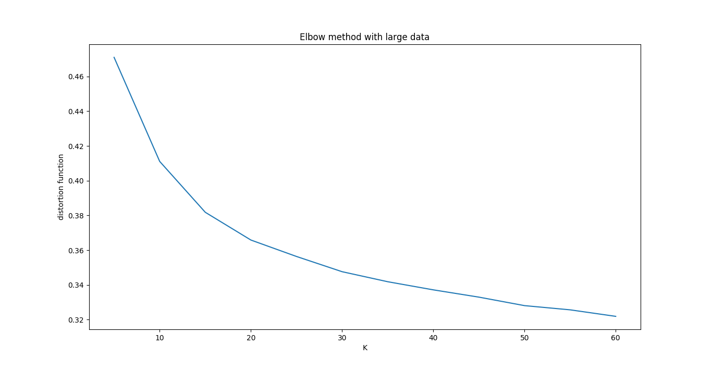

# Practico 1: Clustering

### Introducción

En este trabajo hicimos [clustering](https://es.wikipedia.org/wiki/Algoritmo_de_agrupamiento) sobre un corpus el cual es un conjunto de notas de [la voz del interior](http://www.lavoz.com) (esta en el directorio del repositorio). Para ello tuve que preprocesar las palabras para normalizarlas y poder realizar un análisis morfosintáctico/sintáctico. Luego vectorizar las palabras utilizando algún críterio de reducción de dimensionalidad.
Por una desición propia fui combinando varias formas de normalización junto con vectorización. Más adelante iré explicando los métodos utilizados y como fue mejorando la calidad de los clusters.
Voy a dividir mi trabajo en diferentes intentos viendo como va mejorando la calidad del clustering.

### Pre-procesamiento
----------------------------------------------------------------------------------------------------

Utilice varios procedimientos de pre-procesamiento (que los fui combinando). Aquí listaré un par de ellos

#### Normalización y tokenizador

Antes de cualquier procesamiento tuve que normalizar el texto (utilizando una librería de python [re](https://docs.python.org/3/library/re.html)) debido a que tenía muchos cáracteres no necesarios para este problema. Por ejemplo al principio de cada nota aparecía un "&número" donde número es un dígito de 3 decimales.
Luego de esta normalización tokenize el corpus en oraciones y palabras utilizando [nltk](http://www.nltk.org/). Sólo deje las palabras, es decir quite signos de puntuación, puntos, comas, etc. Además transforme todas las ocurrencias de números en la palabra *num* (obviamente después del análisis morfosintactico).

#### Lematización

En algunos casos utlice lemmatización. Para ello utilice [lexiconista](http://www.lexiconista.com/datasets/lemmatization/) debido a que no encontre ninguna librería decente que haga lemmatización en Español.

#### Taggeador y análisis morfosintáctico

Para taggear utilice dos taggeadores para comparar resultados.
El primer taggeador (que sólo lo utilice para datos pequeños) fue el de [standford](https://nlp.stanford.edu/software/tagger.shtml) y [spacy](https://spacy.io). Además este último hace un análisis de identidad y triplas de dependencia.

#### Eliminación de stopwords

Luego de tokenizar y hacer el análisis morfosintactico quitamos las stopwords.

### Vecorización
--------------------------------------------------------------------------------------------------------

Para vectorizar utilice diferentes features dependiendo el procesamiento previo. Cuando taggeo solamente:
1) POS tag de palabra anterior, siguiente y actual.
2) Si la palabra, palabra anterior y palabra siguiente es un título.
3) Palabra anterior y siguiente.
4) Si es el tagger de standford quedarme con los primeros dos caracteres (debido a que los primeros cáracteres definen que tipo de POS es). Esto con la palabra, palabra anterior y siguiente.

Por otro lado si hago un árbol de parseo, taggeo y análisis de identidad utilizo los suguientes features:
1) POS de la palabra, palabra anterior y siguiente.
2) Triplas de dependencia.
3) Tags de la anterior palabra en la oración (de spacy, ejemplo: si es singular, femenino, etc). También tags de la palabra en sí.

En el siguiente ejemplo se muestra los features con sus respectivas ocurrencias
> {'word-1.totalmente': 1, 'flat.ricardo': 1, 'word+1.lechoso': 1, 'ADJ__Number-1.Sing': 20, 'conj.bandera': 1, 'nsubj.supermercado': 1, 'word-1.raza': 6, 'word+1.<END>': 96, 'ADJ__Gender-1.Masc': 21, 'obj.definir': 2, 'VERB__Mood-1.Sub': 2, 'fixed.de': 2, 'POS+1.ADP': 15, T__PunctType+1.Dash': 3, 'word-1.polvo': 2, 'csubj.dependencia': 1, 'Tense-1.Pres': 28, 'NUM__Number-1.Plur': 1, 'POS-1.PRON': 3, 'Number.Plur': 112, 'NOUN__Gender.Masc': 157, .....

#### Normalización de los vectores

Debido a que utilice ocurrencias de los features fue muy importante normalizar los vectores. Luego de correr k-means descubrí que muchos clusters tenían un sólo elemento por lo que noté que esas palabras tenían una gran ocurrencia en el corpus. Al tener muchas ocurrencias el conteo de features es muy elevada de modo que esa palabra queda sóla en el espacio. Para ello utilice una herramienta en [sklearn](http://scikit-learn.org/stable/modules/preprocessing.html).

#### Reducción de dimensionalidad

Además de normalizar, también reducí la dimensionalidad de dos maneras: con [truncated svd](http://scikit-learn.org/stable/modules/generated/sklearn.decomposition.TruncatedSVD.html) y dejando solamente las palabras que aparecen más de 150 veces.

### Clusterización
---------------------------------------------------------------------------------------------------

Para cluster utilizamos al famosa técnica [K-means](http://scikit-learn.org/stable/modules/generated/sklearn.cluster.KMeans.html). Una incomodidad que me surgio fue como elegir el mejor K, por lo que utilice la *técnica del codo* (feo español) para convencerme de que K utilizar (al final no resulto muy útil).

Lo que podríamos concluir de este gráfico es que deberíamos usar 20 a 30 clusters (pero no fue así :p).

### Resultados y análisis
-------------------------------------------------------------------------------------------------

#### Primer intento

| Proceso                         |  /  |
|:------------------------------ :|:---:|
| Tokenización                    | Si  |
| StopWords                       | NO  |
| Lemmatización                   | NO  |
| Tagger                          | Sta |
| Pos                             | SI  |
| Palabras repetidas              | SI  |
| Palabras con poca ocurrenciass  | SI  |
| Triplas de dependencias         | NO  |
| K (K-means)                     | 27  |
| Normalización de matriz         | NO  |
| Reducción de dimensionalidad    | NO  |

En este cluster no teníamos en cuenta ni la concuerrencia de una palabra ni si era repetida.
[cluster1](cl1.cl). Se eliminaron las stop words... pero nada cambiaba.

##### Conclusión

Este clustering no sirvio para nada porque los clusters eran sumamente grandes, además de que aparecían las mismas palabras en múltiples clusters. Palabras con ocurrencias pequeñas/grandes arruinaban el cluster.

#### Segundo intento

| Proceso                         |  /  |
|:------------------------------ :|:---:|
| Tokenización                    | Si  |
| StopWords                       | NO  |
| Lemmatización                   | NO  |
| Tagger                          | Spa |
| Pos                             | NO  |
| Palabras con poca ocurrenciass  | NO  |
| Palabras repetidas              | NO  |
| Triplas de dependencias         | Si  |
| K (K-means)                     | 27  |
| Normalización de matriz         | NO  |
| Reducción de dimensionalidad    | NO  |

Debido a que todavía no quize aumentar el número de cluster probe una segunda alternativa. La primera diferencia es que empecé utilizando triplas de dependencia por lo que es un poco más morfologica. Además los features serán contados por número de ocurrencias. Elimine palabras repetidas.
[cluster2](cl2.cl)

##### Conclusión

Empezó a tener un poco más de sentido el clustering, sin embargo quería que una palabra en diferente modo sea una sola palabra (caso de cluster 11 y 22). Había avanzado mucho con respecto al primer intento.

Ejemplo de cluster:
2 {'gobierno', 'ley', 'parte', 'vez', 'ciudad', 'provincia'}
8 {'si'}
11 {'años', 'millones'}
17 {'aires', 'argentina', 'villa', 'josé', 'unidos', 'justicia', 'capital', 'federal', 'buenos', 'policía', 'san', 'luis', 'río', 'cámara', 'juan', 'maría', 'carlos', 'cristina', 'nación', 'general', 'daniel', 'fernández', 'schiaretti', 'kirchner'}
22 {'año', 'país'}
21 {'información', 'seguridad', 'cantidad', 'zona', 'situación', 'salud', 'gestión', 'medida', 'relación', 'sociedad', 'historia', 'decisión', 'personas', 'horas', 'manera', 'agua', 'planta', 'empresas', 'causa', 'producción', 'hora', 'forma', 'gente', 'política', 'campaña', 'familia', 'escuela', 'mayoría', 'construcción', 'empresa', 'vida', 'posibilidad', 'investigación', 'mujer', 'obra', 'semana', 'casa', 'deuda', 'oposición', 'falta', 'reunión', 'educación', 'cuenta', 'crisis', 'presidenta', 'muerte', 'actividad'}

#### Intento 3

| Proceso                         |  /  |
|:------------------------------ :|:---:|
| Tokenización                    | SI  |
| StopWords                       | NO  |
| Lemmatización                   | SI  |
| Tagger                          | Spa |
| Pos                             | NO  |
| Palabras con poca ocurrenciass  | NO  |
| Palabras repetidas              | NO  |
| Triplas de dependencias         | SI  |
| K (K-means)                     | 27  |
| Normalización de matriz         | NO  |
| Reducción de dimensionalidad    | NO  |